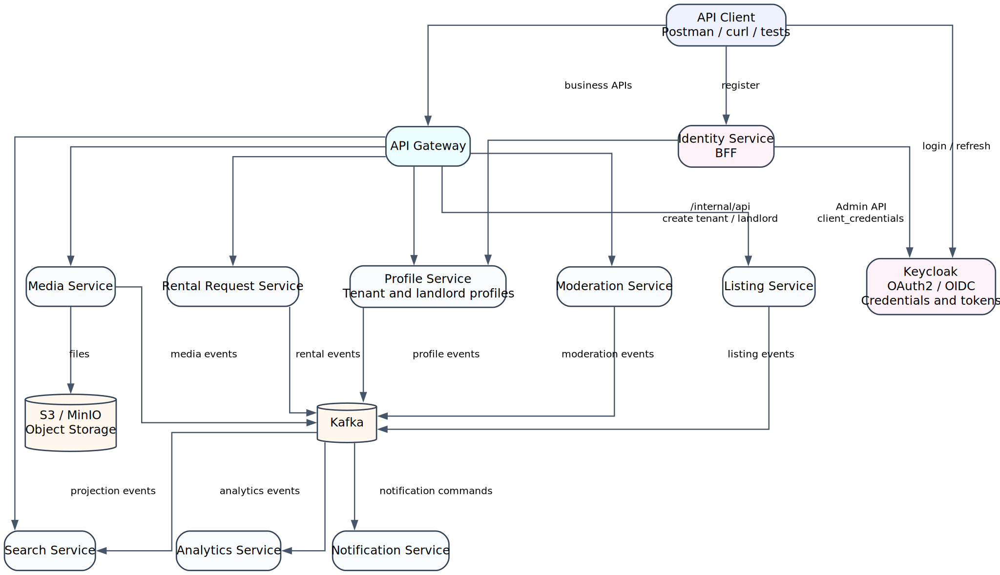
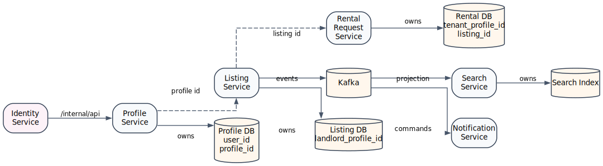
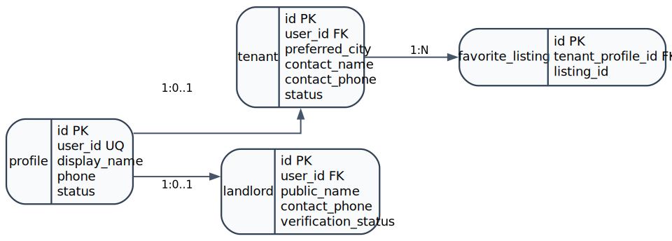
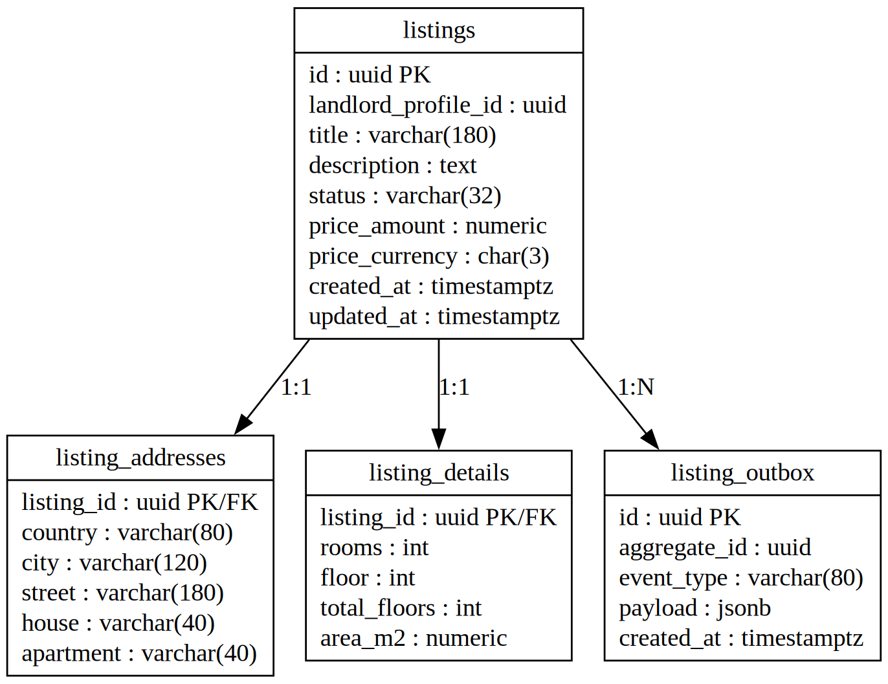
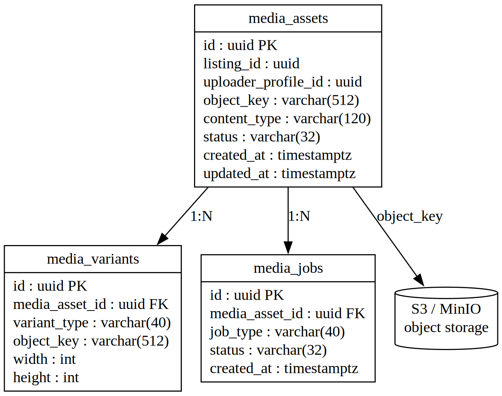
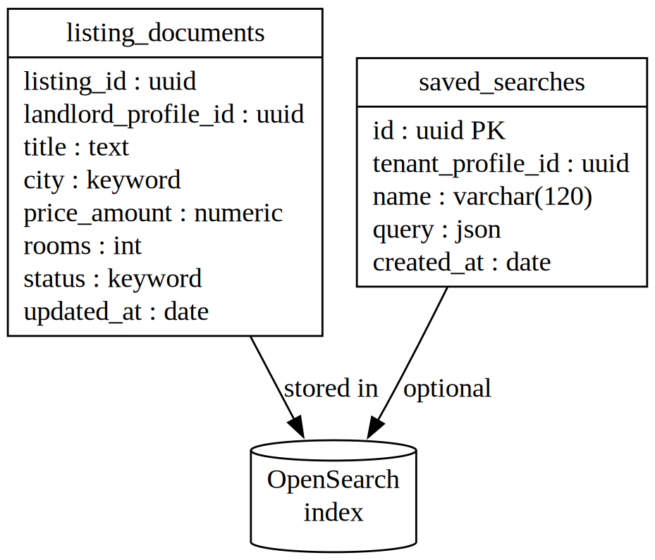
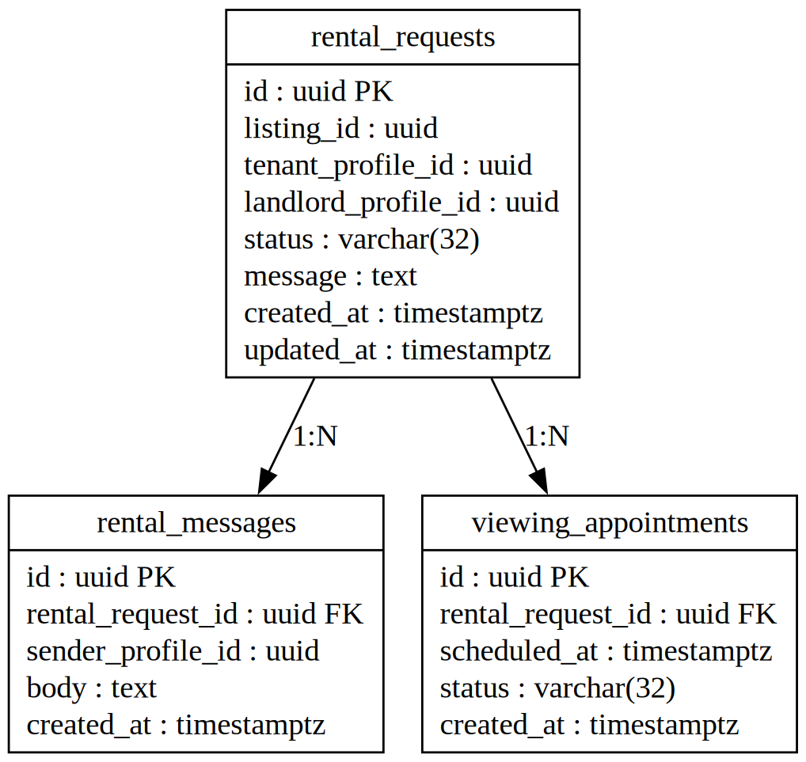
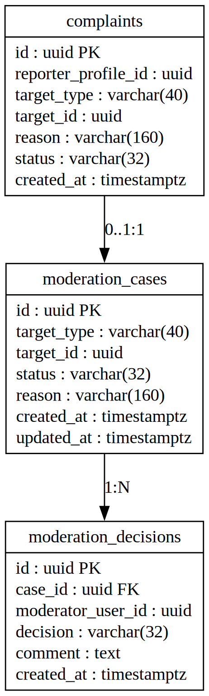

# Estate Booking Platform

[](https://github.com/thisdudkin/estate-booking-platform/actions/workflows/repository-checks.yml)
[](https://github.com/thisdudkin/estate-booking-platform/actions/workflows/maven-verify.yml)
[](https://github.com/thisdudkin/estate-booking-platform/actions/workflows/sonarcloud-analysis.yml)
[](https://github.com/thisdudkin/estate-booking-platform/actions/workflows/container-build.yml)
[](https://github.com/thisdudkin/estate-booking-platform/actions/workflows/container-publish.yml)

Estate Booking Platform is an educational distributed-system blueprint for a real estate rental marketplace. It is
intentionally smaller than a production marketplace, but it is designed with the same architectural discipline: clear
service ownership, explicit data boundaries, secure identity management, reliable integration patterns, and data models
that can grow without being over-engineered on day one.

The project is API-first. A frontend is deliberately out of scope; user journeys are expected to be exercised through
Postman, curl, HTTPie, integration tests, or generated API clients.

## Purpose

The goal is not to clone a full commercial real estate platform. The goal is to practice the decisions that matter in a
serious backend system:

- Decomposing a domain into bounded contexts.
- Delegating authentication to an identity provider.
- Keeping business profiles separate from credentials and sessions.
- Designing registration through an application BFF without leaking identity-provider details into business services.
- Applying database-per-service ownership.
- Combining synchronous APIs with asynchronous events.
- Building read models for search and analytics.
- Making security, idempotency, observability, and testing visible from the beginning.

## Business Scope

The platform models a rental marketplace where landlords publish listings, tenants discover properties and create rental
requests, and moderators review content quality and complaints.

Core capabilities:

- User registration and profile creation.
- Tenant and landlord profile management.
- Listing creation, editing, publication, and archival.
- Media upload metadata and object storage integration.
- Listing moderation and complaints.
- Property search through a denormalized read model.
- Rental requests, conversations, and viewing appointments.
- Notifications based on domain events.
- Basic analytical projections.

Out of scope for the educational version:

- Frontend application.
- Online payments.
- Legal document signing.
- Production-grade fraud detection.
- Real SMS, email, KYC, or geocoding providers.
- Advanced recommendation algorithms.

## System Context

The API Gateway is the public entry point for business APIs. Keycloak owns authentication, credentials, sessions, and
token issuance. Identity Service is the application-facing BFF for registration and profile bootstrap. Business services
own business data. Kafka is used for propagation, projections, and decoupled side effects rather than for every
interaction.

### Container Diagram



## Architectural Principles

### Business Capability First

Services are split by ownership of business decisions, not by technical layers. Listing Service owns listing lifecycle
decisions. Profile Service owns user-facing business profiles. Search Service owns query-optimized documents, not
canonical listing state.

### Database per Service

Every service owns its own schema, database, or collection set. A service may store external identifiers from another
service, but it must not create cross-service foreign keys or read another service database directly.

### Keycloak Is the Identity Provider

Keycloak owns credentials, sessions, token issuance, realm roles, clients, and identity-provider protocol concerns.
Identity Service may call Keycloak Admin API as a trusted backend client during registration, but public clients must
not
receive Keycloak administration privileges. Application services validate JWTs locally and enforce business
authorization rules in their own context.

### Profiles Are Business Data, Not Credentials

Profile Service exists because the marketplace needs domain representations of a user that are different from the
identity-provider account. Keycloak answers "Can this subject authenticate?" Profile Service answers "Which marketplace
profiles does this subject have, and what business attributes are attached to them?"

### Integration Must Be Explicit

Synchronous calls are used when the caller needs an immediate decision. Events are used when consumers can update their
own projections asynchronously. Commands and events should not be mixed casually.

### Demo Scope, Scalable Shape

The data models are intentionally compact. They avoid premature enterprise complexity, while leaving clear extension
points for verification, auditing, preferences, media processing, and event publication.

## Service Map

| Service                | Main Responsibility                                                        | Storage            | Notes                                             |
|------------------------|----------------------------------------------------------------------------|--------------------|---------------------------------------------------|
| API Gateway            | External routing, token relay, edge validation, coarse rate limits         | None               | Does not orchestrate business workflows.          |
| Keycloak               | Credentials, sessions, clients, realm roles, tokens                        | PostgreSQL         | External identity provider.                       |
| Identity Service       | Registration BFF, Keycloak orchestration, default tenant profile bootstrap | PostgreSQL         | Owns registration workflow state and idempotency. |
| Profile Service        | Tenant and landlord business profiles linked to Keycloak user IDs          | PostgreSQL         | Stores business profile data, not credentials.    |
| Listing Service        | Listing aggregate, address, details, lifecycle, publication events         | PostgreSQL         | Source of truth for listings.                     |
| Media Service          | Media metadata, upload state, processing jobs                              | MongoDB + S3/MinIO | Files live in object storage.                     |
| Search Service         | Denormalized listing search documents and saved searches                   | OpenSearch         | Projection, not source of truth.                  |
| Moderation Service     | Moderation cases, decisions, complaints                                    | PostgreSQL         | Owns review process.                              |
| Rental Request Service | Requests, messages, viewing appointments                                   | PostgreSQL         | Owns tenant-landlord negotiation flow.            |
| Notification Service   | Notification preferences, templates, delivery state                        | MongoDB            | Event-driven side effects.                        |
| Analytics Service      | Event ingestion and analytical aggregates                                  | ClickHouse         | Optional in the first implementation.             |

## Security Model


Normal business requests must not call Keycloak for token introspection. Gateway and services validate JWT signatures
locally using Keycloak JWKS. Keycloak is contacted for token issuance, refresh, discovery, key rotation, Admin API
operations, and service-to-service client credentials flows.

Token rules:

| Token         | Sent to Business Services | Purpose                                          |
|---------------|--------------------------:|--------------------------------------------------|
| Access token  |                       Yes | API authorization.                               |
| Refresh token |                        No | Client obtains a new access token from Keycloak. |
| ID token      |                        No | Client-side OIDC identity information.           |
| Service token |                 Sometimes | Machine-to-machine calls.                        |

Self-service profile capabilities:

| Capability       | Policy                                                          |
|------------------|-----------------------------------------------------------------|
| Tenant profile   | Created by default during registration.                         |
| Landlord profile | Created explicitly by the authenticated user when they need it. |
| `MODERATOR` role | Admin-assigned only.                                            |
| `ADMIN` role     | Admin-assigned only.                                            |

## Registration Architecture

Registration is exposed through Identity Service, an application BFF. Keycloak still owns credentials, password policy,
email verification, sessions, and tokens, but public clients do not talk to Keycloak Admin API and do not decide which
business profile tables should be created.

Identity Service creates the Keycloak user, then calls Profile Service over `/internal/api/` with a service token
obtained through OAuth2 Client Credentials. Profile Service creates a tenant profile by default. Later, the same user
can
create a landlord profile with the same Keycloak `userId`, so Nikolay can rent an apartment in Ufa and publish an
apartment in Sochi without creating a second account.

### Architectural Decision

Use Identity Service as the registration BFF and profile bootstrap orchestrator.

This is the best fit for the project because:

- It keeps Keycloak responsible for identity-provider concerns: credentials, password policy, email verification,
  required actions, sessions, and tokens.
- It removes the Keycloak SPI dependency from the normal application flow.
- It avoids modeling tenant and landlord as mutually exclusive registration-time roles.
- It gives the platform a synchronous registration result: either both the Keycloak user and default tenant profile are
  created, or Identity Service returns a clear provisioning error.
- It keeps Profile Service focused on business data and protects its internal provisioning endpoints with
  service-to-service authentication.

### Registration Sequence Diagram


### Registration API Behavior

Recommended behavior:

1. The client calls `POST /api/identity/register` on Identity Service.
2. Identity Service validates the command and creates the user in Keycloak through a trusted backend client.
3. Identity Service obtains a service access token from Keycloak using Grant Type `client_credentials`.
4. Identity Service calls Profile Service through `/internal/api/profiles/tenant` and sends the service token.
5. Profile Service validates that the caller is the `identity-service` client and creates the default tenant profile.
6. The user can authenticate through Keycloak and call business APIs through API Gateway.
7. If the same user wants to publish apartments, the client calls `POST /api/identity/me/landlord-profile`.
8. Identity Service calls `/internal/api/profiles/landlord` with the same `keycloakUserId`; Profile Service creates a
   landlord profile without creating another user account.

The registration request must not contain `TENANT`, `LANDLORD`, `ADMIN`, or `MODERATOR` as user-controlled role
assignments. Tenant is the default marketplace capability. Landlord is an additional business profile that a user may
create later.

### Why Profile Service Is Required

Using only Keycloak user attributes would look simpler at first, but it would couple marketplace data to the identity
provider. That becomes limiting very quickly:

- Business services need stable profile identifiers and marketplace-specific fields.
- Tenant and landlord data evolve independently of authentication.
- Profile data often needs business validation, auditability, searchability, and lifecycle states.
- Keycloak should remain replaceable; the domain should not depend on its internal user model.
- One Keycloak account can have both tenant and landlord profiles without creating duplicate credentials.

Profile Service therefore acts as the canonical business profile service. It links business profiles to
`user_id`, but it does not store usernames, passwords, refresh tokens, sessions, identity-provider attributes,
or authentication secrets.

### Failure Handling

Registration is a synchronous orchestration with a small distributed consistency problem: Keycloak and Profile Service
do not share a database transaction. Identity Service owns the recovery policy:

- Calls to Profile Service internal provisioning endpoints must be idempotent by `user_id` and profile type.
- If Keycloak user creation succeeds but tenant profile creation fails, Identity Service records the failed workflow and
  retries or compensates by disabling/removing the Keycloak user according to the demo policy.
- Business APIs should return `409 PROFILE_NOT_READY` only for users whose registration workflow is still recovering.
- No password, token, credential, or secret may appear in Profile Service payloads, Kafka events, or logs.

## Cross-Service References



External identifiers are copied where needed, but they are references, not database-level foreign keys across service
boundaries.

## Core Data Models

The following schemas are intentionally simple. They are suitable for a demo implementation while leaving clear room for
future evolution.



---



---



---



---



---



## Events

All domain events should use a common envelope.

```json
{
  "eventId": "uuid",
  "eventType": "ListingPublished",
  "aggregateType": "Listing",
  "aggregateId": "listingId",
  "aggregateVersion": 3,
  "occurredAt": "2026-06-27T12:00:00Z",
  "producer": "listing-service",
  "correlationId": "uuid",
  "payload": {
    "listingId": "listingId",
    "landlordProfileId": "profileId"
  }
}
```

Recommended first event set:

| Producer               | Events                                                                                                     |
|------------------------|------------------------------------------------------------------------------------------------------------|
| Profile Service        | `TenantProfileCreated`, `LandlordProfileCreated`, `ProfileUpdated`                                         |
| Listing Service        | `ListingCreated`, `ListingUpdated`, `ListingSubmittedForModeration`, `ListingPublished`, `ListingArchived` |
| Media Service          | `MediaUploaded`, `MediaReady`, `MediaRejected`, `MediaDeleted`                                             |
| Moderation Service     | `ModerationCaseCreated`, `ListingApproved`, `ListingRejected`, `ComplaintCreated`                          |
| Rental Request Service | `RentalRequestCreated`, `RentalRequestAccepted`, `RentalRequestRejected`, `ViewingScheduled`               |
| Notification Service   | `NotificationCreated`, `NotificationSent`, `NotificationFailed`                                            |

SQL-backed services that publish events should use the transactional outbox pattern. Event consumers should be
idempotent and store processed event identifiers or projection offsets.

## Listing Lifecycle


## API Surface

Recommended public routes:

| Method  | Route                                     | Service                |
|---------|-------------------------------------------|------------------------|
| `POST`  | `/api/identity/register`                  | Identity Service       |
| `POST`  | `/api/identity/me/landlord-profile`       | Identity Service       |
| `GET`   | `/api/profiles/me`                        | Profile Service        |
| `PATCH` | `/api/profiles/me`                        | Profile Service        |
| `POST`  | `/api/listings`                           | Listing Service        |
| `GET`   | `/api/listings/{id}`                      | Listing Service        |
| `POST`  | `/api/listings/{id}/submit`               | Listing Service        |
| `POST`  | `/api/listings/{id}/media`                | Media Service          |
| `GET`   | `/api/search/listings`                    | Search Service         |
| `POST`  | `/api/rental-requests`                    | Rental Request Service |
| `POST`  | `/api/moderation/listings/{id}/decisions` | Moderation Service     |

Recommended internal routes:

| Method | Route                             | Service         | Caller           |
|--------|-----------------------------------|-----------------|------------------|
| `POST` | `/internal/api/profiles/tenant`   | Profile Service | Identity Service |
| `POST` | `/internal/api/profiles/landlord` | Profile Service | Identity Service |

Internal routes require a service access token issued through Grant Type `client_credentials`. Profile Service must
verify the token audience/client and reject user access tokens on `/internal/api/`.

## Reliability Guidelines

- Use timeouts for all synchronous downstream calls.
- Retry only idempotent operations or operations protected by idempotency keys.
- Use circuit breakers around critical service-to-service calls.
- Use optimistic locking on aggregates with user-visible lifecycle transitions.
- Make Identity Service registration workflows recoverable when Keycloak succeeds but Profile Service is temporarily
  unavailable.
- Make Profile Service internal provisioning idempotent by `user_id` and profile type.
- Use transactional outbox for SQL-to-Kafka publication.
- Use dead-letter topics for messages that cannot be processed safely.
- Propagate `correlationId` across HTTP headers, logs, and Kafka headers.

## Testing Strategy

| Level             | Purpose                                               | Suggested Tooling              |
|-------------------|-------------------------------------------------------|--------------------------------|
| Unit tests        | Domain rules and application services                 | JUnit 5, AssertJ, Mockito      |
| Integration tests | Database, Kafka, Keycloak, object storage integration | Testcontainers                 |
| Contract tests    | API compatibility between services                    | Pact or Spring Cloud Contract  |
| Security tests    | Role checks, ownership checks, JWT validation         | Spring Security Test           |
| End-to-end tests  | Main user flows through the gateway                   | Postman/Newman or REST Assured |

Critical flows to test first:

- Successful registration through Identity Service.
- Keycloak user creation through a trusted backend client.
- Client Credentials token acquisition by Identity Service.
- Default tenant profile creation through `/internal/api/profiles/tenant`.
- Rejection of user access tokens on Profile Service internal endpoints.
- Idempotent tenant profile creation for duplicate registration retries.
- Landlord profile creation for an existing user with the same `user_id`.
- Rejection of self-service `ADMIN` and `MODERATOR` role assignment.
- Recovery when Keycloak user creation succeeds but Profile Service is temporarily unavailable.
- Listing publication and search projection update.

## Observability

The educational version should still behave like a system that can be diagnosed:

- Structured JSON logs.
- Correlation ID propagation.
- Spring Boot Actuator health and readiness endpoints.
- Micrometer metrics.
- OpenTelemetry traces.
- Prometheus and Grafana for local observability.
- Kafka consumer lag monitoring.

This structure is intentionally conventional. It keeps the learning curve reasonable while preserving separation between
HTTP adapters, application use cases, domain rules, and infrastructure details.

## Local Infrastructure

A representative local environment may include:

- PostgreSQL for Keycloak and SQL-backed services.
- Keycloak.
- Identity Service.
- Apache Kafka and Kafka UI.
- MongoDB.
- OpenSearch.
- MinIO or another S3-compatible object store.
- Optional ClickHouse for analytics.
- Prometheus and Grafana.

## Design Trade-Offs

This project intentionally prefers clarity to maximal realism. Some choices would need stronger treatment in
production: tenant verification, privacy controls, abuse detection, rate limiting, audit retention, secrets management,
backup strategy, and operational runbooks.

That is acceptable for a demo. The important point is that the architecture does not paint the project into a corner.
Each service owns a coherent part of the domain, each data model has room to evolve, and registration keeps credentials
inside the identity provider while profile provisioning is handled through an explicit, idempotent Identity Service to
Profile Service workflow.
