# Estate Booking Platform

[](https://github.com/thisdudkin/estate-booking-platform/actions/workflows/repository-checks.yml)
[](https://github.com/thisdudkin/estate-booking-platform/actions/workflows/maven-verify.yml)
[](https://github.com/thisdudkin/estate-booking-platform/actions/workflows/sonarcloud-analysis.yml)
[](https://github.com/thisdudkin/estate-booking-platform/actions/workflows/container-build.yml)
[](https://github.com/thisdudkin/estate-booking-platform/actions/workflows/container-publish.yml)

Estate Booking Platform is an educational distributed-system blueprint for a real estate rental marketplace. It is
intentionally smaller than a production marketplace, but it is designed with the same architectural discipline: clear
service ownership, explicit data boundaries, secure identity management, reliable integration patterns, and data models
that can grow without being over-engineered on day one.

The project is API-first. A frontend is deliberately out of scope; user journeys are expected to be exercised through
Postman, curl, HTTPie, integration tests, or generated API clients.

## Purpose

The goal is not to clone a full commercial real estate platform. The goal is to practice the decisions that matter in a
serious backend system:

- Decomposing a domain into bounded contexts.
- Delegating authentication to an identity provider.
- Keeping business profiles separate from credentials and sessions.
- Designing registration as an identity-provider-owned flow with asynchronous profile provisioning.
- Applying database-per-service ownership.
- Combining synchronous APIs with asynchronous events.
- Building read models for search and analytics.
- Making security, idempotency, observability, and testing visible from the beginning.

## Business Scope

The platform models a rental marketplace where landlords publish listings, tenants discover properties and create rental
requests, and moderators review content quality and complaints.

Core capabilities:

- User registration and profile creation.
- Tenant and landlord profile management.
- Listing creation, editing, publication, and archival.
- Media upload metadata and object storage integration.
- Listing moderation and complaints.
- Property search through a denormalized read model.
- Rental requests, conversations, and viewing appointments.
- Notifications based on domain events.
- Basic analytical projections.

Out of scope for the educational version:

- Frontend application.
- Online payments.
- Legal document signing.
- Production-grade fraud detection.
- Real SMS, email, KYC, or geocoding providers.
- Advanced recommendation algorithms.

## System Context

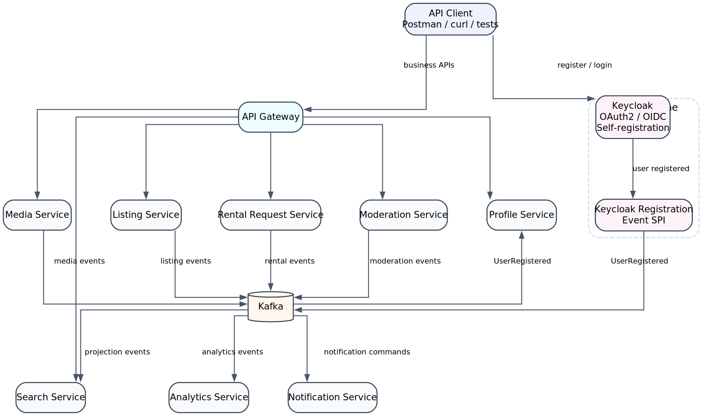

The API Gateway is the public entry point for business APIs. Keycloak owns authentication and user self-registration.
Business services own business data. Kafka is used for propagation, projections, and decoupled side effects rather than
for every interaction.

## Architectural Principles

### Business Capability First

Services are split by ownership of business decisions, not by technical layers. Listing Service owns listing lifecycle
decisions. Profile Service owns user-facing business identity. Search Service owns query-optimized documents, not
canonical listing state.

### Database per Service

Every service owns its own schema, database, or collection set. A service may store external identifiers from another
service, but it must not create cross-service foreign keys or read another service database directly.

### Keycloak Is the Identity Provider

Keycloak owns credentials, sessions, token issuance, realm roles, clients, self-registration, and identity-provider
protocol concerns. Application services validate JWTs locally and enforce business authorization rules in their own
context.

### Profiles Are Business Data, Not Credentials

Profile Service exists because the marketplace needs a domain representation of a user that is different from the
identity-provider account. Keycloak answers "Can this subject authenticate and what roles does it have?" Profile Service
answers "Who is this participant in the marketplace and what business attributes are attached to them?"

### Integration Must Be Explicit

Synchronous calls are used when the caller needs an immediate decision. Events are used when consumers can update their
own projections asynchronously. Commands and events should not be mixed casually.

### Demo Scope, Scalable Shape

The data models are intentionally compact. They avoid premature enterprise complexity, while leaving clear extension
points for verification, auditing, preferences, media processing, and event publication.

## Service Map

| Service                         | Main Responsibility                                                           | Storage            | Notes                                            |
|---------------------------------|-------------------------------------------------------------------------------|--------------------|--------------------------------------------------|
| API Gateway                     | External routing, token relay, edge validation, coarse rate limits            | None               | Does not orchestrate business workflows.         |
| Keycloak                        | Credentials, sessions, clients, realm roles, tokens                           | PostgreSQL         | External identity provider.                      |
| Keycloak Registration Event SPI | Publishes explicit registration events after successful Keycloak registration | None               | Lightweight integration adapter inside Keycloak. |
| Profile Service                 | User profiles, tenant and landlord extensions, contact data, preferences      | PostgreSQL         | Canonical business representation of users.      |
| Listing Service                 | Listing aggregate, address, details, lifecycle, publication events            | PostgreSQL         | Source of truth for listings.                    |
| Media Service                   | Media metadata, upload state, processing jobs                                 | MongoDB + S3/MinIO | Files live in object storage.                    |
| Search Service                  | Denormalized listing search documents and saved searches                      | OpenSearch         | Projection, not source of truth.                 |
| Moderation Service              | Moderation cases, decisions, complaints                                       | PostgreSQL         | Owns review process.                             |
| Rental Request Service          | Requests, messages, viewing appointments                                      | PostgreSQL         | Owns tenant-landlord negotiation flow.           |
| Notification Service            | Notification preferences, templates, delivery state                           | MongoDB            | Event-driven side effects.                       |
| Analytics Service               | Event ingestion and analytical aggregates                                     | ClickHouse         | Optional in the first implementation.            |

## Security Model

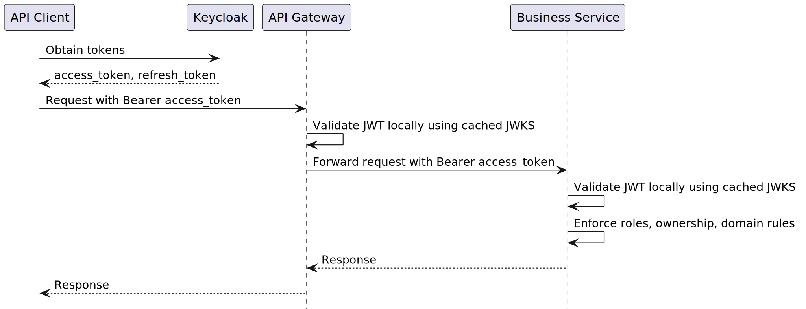

Normal business requests must not call Keycloak for token introspection. Gateway and services validate JWT signatures
locally using Keycloak JWKS. Keycloak is contacted for token issuance, refresh, discovery, key rotation, Admin API
operations, and service-to-service client credentials flows.

Token rules:

| Token         | Sent to Business Services | Purpose                                          |
|---------------|--------------------------:|--------------------------------------------------|
| Access token  |                       Yes | API authorization.                               |
| Refresh token |                        No | Client obtains a new access token from Keycloak. |
| ID token      |                        No | Client-side OIDC identity information.           |
| Service token |                 Sometimes | Machine-to-machine calls.                        |

Self-service roles:

| Role        | Registration Policy                         |
|-------------|---------------------------------------------|
| `TENANT`    | Allowed.                                    |
| `LANDLORD`  | Allowed, with later verification if needed. |
| `MODERATOR` | Admin-assigned only.                        |
| `ADMIN`     | Admin-assigned only.                        |

## Registration Architecture

Registration should be owned by Keycloak, not by an application-level proxy. The client can use Keycloak
self-registration directly, while the platform reacts to successful user creation through an explicit registration
event.

The recommended integration for this demo is a Keycloak Event Listener SPI that publishes a compact `UserRegistered`
event to Kafka. Profile Service consumes this event and creates the corresponding business profile idempotently.

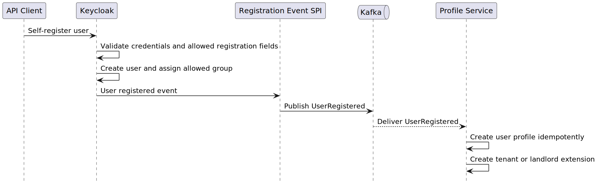

### Architectural Decision

Use Keycloak self-registration plus a Keycloak Event Listener SPI as the primary registration integration.

This is the best fit for the project because:

- It keeps Keycloak as the only component responsible for registration, credentials, password policy, email
  verification, required actions, and account lifecycle.
- It avoids building a thin Identity API that mostly proxies Keycloak and duplicates identity-provider responsibilities.
- It publishes a deliberate integration event instead of leaking Keycloak database internals into the platform.
- It keeps Profile Service asynchronous, idempotent, and independent of the registration HTTP request.
- It is educationally valuable: the project demonstrates identity-provider extension points without introducing a full
  custom identity facade.

### Role Selection During Registration

The client must not be allowed to assign arbitrary roles. Self-registration should support only `TENANT` and `LANDLORD`.

A practical demo approach:

- Keycloak registration form contains a required `requested_role` field.
- The field is rendered as a controlled choice: `TENANT` or `LANDLORD`.
- Keycloak stores the selected value as a user attribute.
- The SPI accepts only `TENANT` or `LANDLORD`.
- The SPI assigns the corresponding safe group if it is not already assigned by a controlled Keycloak flow.
- `MODERATOR` and `ADMIN` are never self-service roles.
- The event contains the effective role/group after validation, not an untrusted raw client value.

Practical browser flow:

1. The user opens the Keycloak registration page.
2. The user fills in email, username, password, and display name.
3. The user selects account type: `Tenant` or `Landlord`.
4. Keycloak creates the user and stores `requested_role=TENANT` or `requested_role=LANDLORD`.
5. The Registration Event SPI validates the attribute, assigns the safe group, and publishes `UserRegistered`.
6. Profile Service consumes the event and creates `tenant_profiles` or `landlord_profiles`.

For Postman, the recommended demo workflow is still browser-based registration followed by token retrieval in Postman.
Native Keycloak self-registration is primarily a browser form flow, not a stable public JSON registration API. In
Postman:

1. Open the Keycloak registration page in a browser and register the user with account type `Tenant` or `Landlord`.
2. Request tokens from the Keycloak token endpoint using that user.
3. Use the returned access token when calling platform APIs through API Gateway.

If a pure Postman-only registration demo is required, add a very small custom Keycloak registration endpoint or use a
controlled admin-only seed script for test users. Avoid exposing the Keycloak Admin API directly to public clients.

### Why Profile Service Is Required

Using only Keycloak user attributes would look simpler at first, but it would couple marketplace data to the identity
provider. That becomes limiting very quickly:

- Business services need stable profile identifiers and marketplace-specific fields.
- Tenant and landlord data evolve independently of authentication.
- Profile data often needs business validation, auditability, searchability, and lifecycle states.
- Keycloak should remain replaceable; the domain should not depend on its internal user model.
- Different roles may require different profile extensions without polluting the identity provider.

Profile Service therefore acts as the canonical business identity service. It links a domain profile to
`keycloak_user_id`, but it does not store passwords, refresh tokens, sessions, or authentication secrets.

### Event Contract

```json
{
  "eventId": "uuid",
  "eventType": "UserRegistered",
  "occurredAt": "2026-06-27T12:00:00Z",
  "producer": "keycloak-registration-spi",
  "payload": {
    "keycloakUserId": "uuid",
    "email": "tenant@example.com",
    "displayName": "John Tenant",
    "role": "TENANT",
    "emailVerified": false
  }
}
```

Profile Service treats this event as at-least-once delivery. The unique constraint on `keycloak_user_id` makes profile
creation idempotent.

### Failure Handling

This model is eventually consistent. A user may exist in Keycloak before their business profile is created. Business
APIs should handle that explicitly:

- If a user calls a business API before profile provisioning finishes, return `409 PROFILE_NOT_READY` or
  `423 PROFILE_PROVISIONING`.
- Profile Service consumers must be retryable and idempotent.
- Failed events should go to a dead-letter topic after bounded retries.
- Operational tooling can replay `UserRegistered` events or rebuild missing profiles from Keycloak if needed.
- No password, token, credential, or secret may appear in Kafka events or logs.

## Data Ownership

### Data Stores Ownership

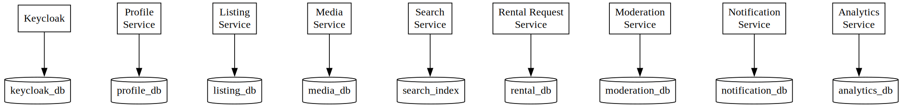

### Cross-Service References

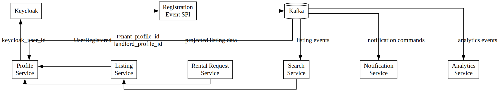

External identifiers are copied where needed, but they are references, not database-level foreign keys across service
boundaries.

## Core Data Models

The following schemas are intentionally simple. They are suitable for a demo implementation while leaving clear room for
future evolution.

### Profile Service

Profile Service separates the common user profile from role-specific extensions.

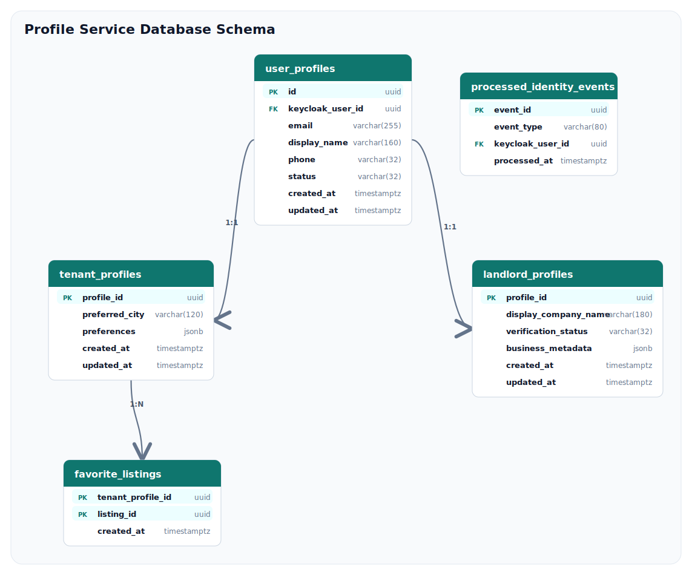

Profile Service schema rationale:

- `user_profiles` contains attributes common to any marketplace participant.
- `tenant_profiles` and `landlord_profiles` let role-specific data evolve independently.
- `keycloak_user_id` preserves the link to authentication without making Keycloak the business data store.
- `preferences` and `business_metadata` are JSON extension points for a demo; stable frequently queried fields can be
  promoted to columns later.
- `favorite_listings.listing_id` is an external reference because Listing Service owns listing data.
- `processed_identity_events` protects consumers from duplicate Kafka delivery.

### Listing Service

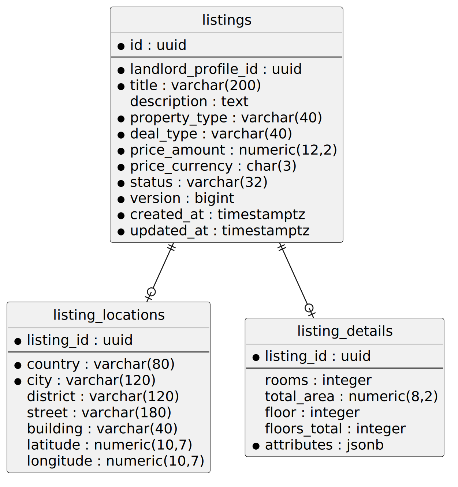

### Media Service

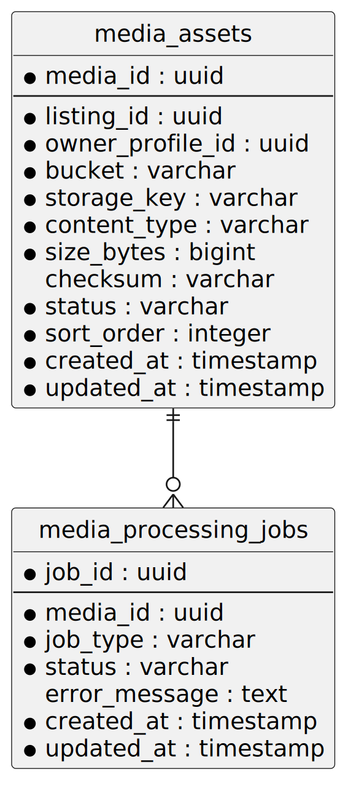

### Search Service

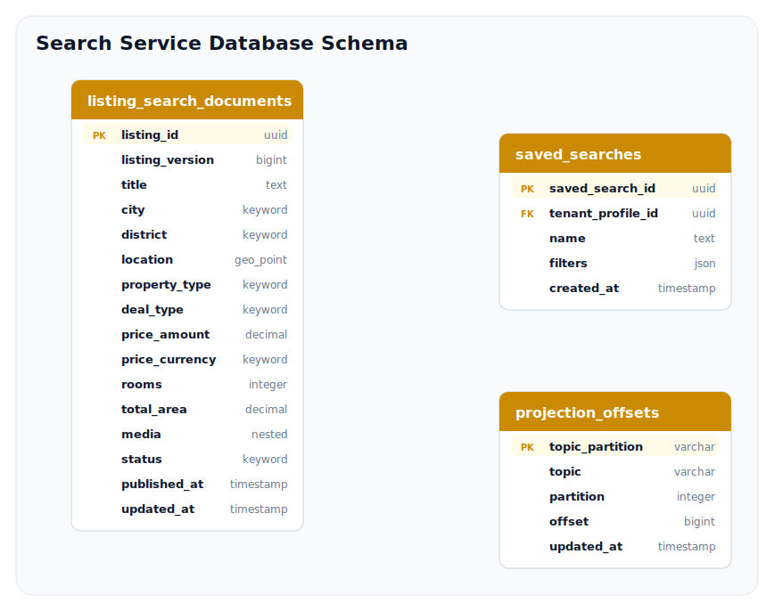

Search documents are disposable projections. They can be rebuilt from Listing, Media, and Moderation events.

### Rental Request Service

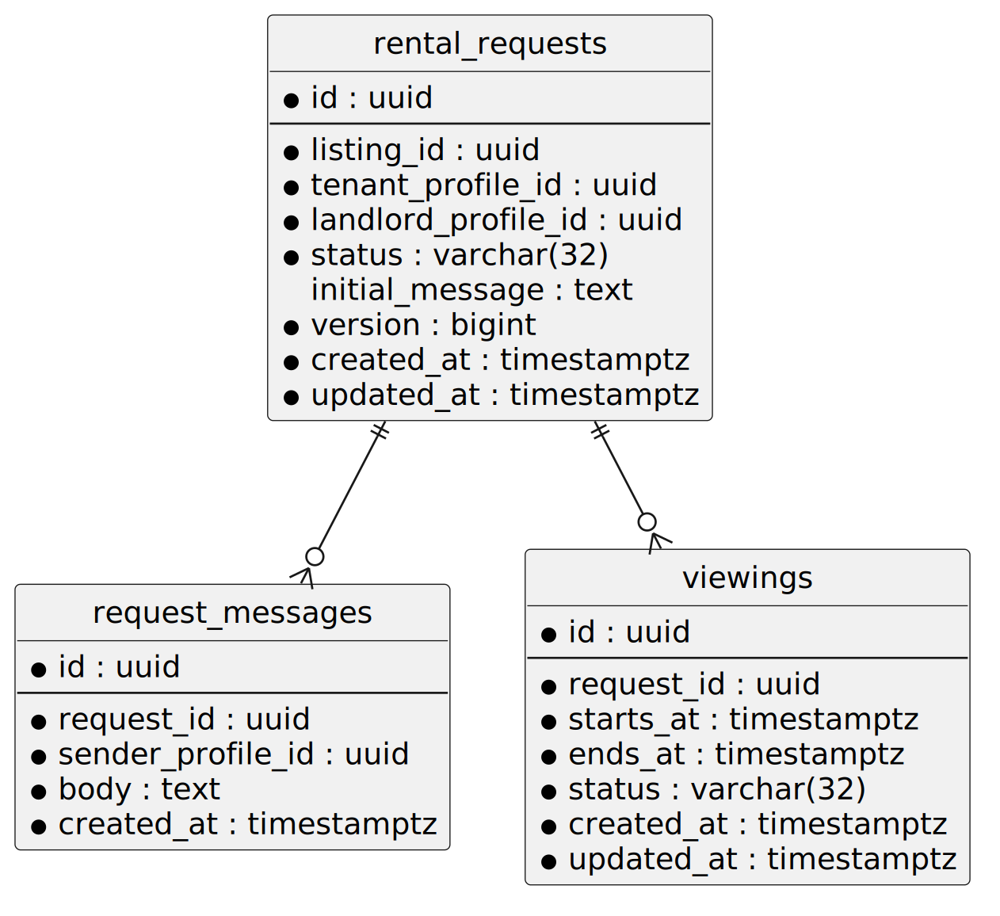

### Moderation Service

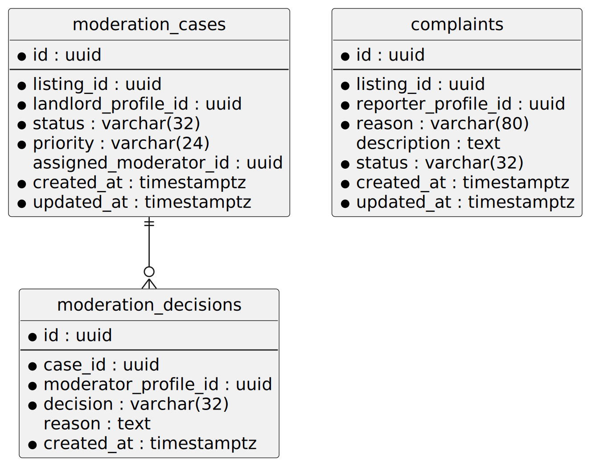

## Events

All domain events should use a common envelope.

```json
{
  "eventId": "uuid",
  "eventType": "ListingPublished",
  "aggregateType": "Listing",
  "aggregateId": "listingId",
  "aggregateVersion": 3,
  "occurredAt": "2026-06-27T12:00:00Z",
  "producer": "listing-service",
  "correlationId": "uuid",
  "payload": {
    "listingId": "listingId",
    "landlordProfileId": "profileId"
  }
}
```

Recommended first event set:

| Producer                        | Events                                                                                                     |
|---------------------------------|------------------------------------------------------------------------------------------------------------|
| Keycloak Registration Event SPI | `UserRegistered`                                                                                           |
| Listing Service                 | `ListingCreated`, `ListingUpdated`, `ListingSubmittedForModeration`, `ListingPublished`, `ListingArchived` |
| Media Service                   | `MediaUploaded`, `MediaReady`, `MediaRejected`, `MediaDeleted`                                             |
| Moderation Service              | `ModerationCaseCreated`, `ListingApproved`, `ListingRejected`, `ComplaintCreated`                          |
| Rental Request Service          | `RentalRequestCreated`, `RentalRequestAccepted`, `RentalRequestRejected`, `ViewingScheduled`               |
| Notification Service            | `NotificationCreated`, `NotificationSent`, `NotificationFailed`                                            |

SQL-backed services that publish events should use the transactional outbox pattern. Event consumers should be
idempotent and store processed event identifiers or projection offsets.

## Listing Lifecycle

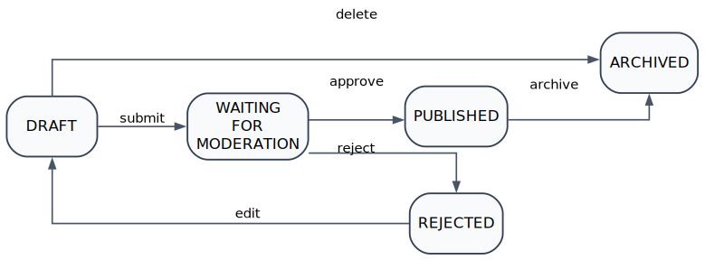

## API Surface

Recommended public routes:

| Method  | Route                                     | Service                |
|---------|-------------------------------------------|------------------------|
| `POST`  | Keycloak registration endpoint            | Keycloak               |
| `POST`  | Keycloak token endpoint                   | Keycloak               |
| `GET`   | `/api/profiles/me`                        | Profile Service        |
| `PATCH` | `/api/profiles/me`                        | Profile Service        |
| `POST`  | `/api/listings`                           | Listing Service        |
| `GET`   | `/api/listings/{id}`                      | Listing Service        |
| `POST`  | `/api/listings/{id}/submit`               | Listing Service        |
| `POST`  | `/api/listings/{id}/media`                | Media Service          |
| `GET`   | `/api/search/listings`                    | Search Service         |
| `POST`  | `/api/rental-requests`                    | Rental Request Service |
| `POST`  | `/api/moderation/listings/{id}/decisions` | Moderation Service     |

## Reliability Guidelines

- Use timeouts for all synchronous downstream calls.
- Retry only idempotent operations or operations protected by idempotency keys.
- Use circuit breakers around critical service-to-service calls.
- Use optimistic locking on aggregates with user-visible lifecycle transitions.
- Use transactional outbox for SQL-to-Kafka publication.
- Use dead-letter topics for messages that cannot be processed safely.
- Make Kafka consumers idempotent, especially the `UserRegistered` consumer in Profile Service.
- Propagate `correlationId` across HTTP headers, logs, and Kafka headers.

## Testing Strategy

| Level             | Purpose                                               | Suggested Tooling              |
|-------------------|-------------------------------------------------------|--------------------------------|
| Unit tests        | Domain rules and application services                 | JUnit 5, AssertJ, Mockito      |
| Integration tests | Database, Kafka, Keycloak, object storage integration | Testcontainers                 |
| Contract tests    | API compatibility between services                    | Pact or Spring Cloud Contract  |
| Security tests    | Role checks, ownership checks, JWT validation         | Spring Security Test           |
| End-to-end tests  | Main user flows through the gateway                   | Postman/Newman or REST Assured |

Critical flows to test first:

- Successful tenant self-registration in Keycloak.
- Successful landlord self-registration in Keycloak.
- Rejection of self-service `ADMIN` and `MODERATOR` role assignment.
- `UserRegistered` event publication by the Keycloak SPI.
- Idempotent profile creation from duplicate `UserRegistered` events.
- Profile-not-ready response before asynchronous provisioning completes.
- Dead-letter handling for malformed identity events.
- Listing publication and search projection update.

## Observability

The educational version should still behave like a system that can be diagnosed:

- Structured JSON logs.
- Correlation ID propagation.
- Spring Boot Actuator health and readiness endpoints.
- Micrometer metrics.
- OpenTelemetry traces.
- Prometheus and Grafana for local observability.
- Kafka consumer lag monitoring.

This structure is intentionally conventional. It keeps the learning curve reasonable while preserving separation between
HTTP adapters, application use cases, domain rules, and infrastructure details.

## Local Infrastructure

A representative local environment may include:

- PostgreSQL for Keycloak and SQL-backed services.
- Keycloak.
- Keycloak Registration Event SPI.
- Apache Kafka and Kafka UI.
- MongoDB.
- OpenSearch.
- MinIO or another S3-compatible object store.
- Optional ClickHouse for analytics.
- Prometheus and Grafana.

## Design Trade-Offs

This project intentionally prefers clarity to maximal realism. Some choices would need stronger treatment in
production: tenant verification, privacy controls, abuse detection, rate limiting, audit retention, secrets management,
backup strategy, and operational runbooks.

That is acceptable for a demo. The important point is that the architecture does not paint the project into a corner.
Each service owns a coherent part of the domain, each data model has room to evolve, and registration remains firmly
inside the identity provider while profile provisioning is handled through explicit, idempotent events.
