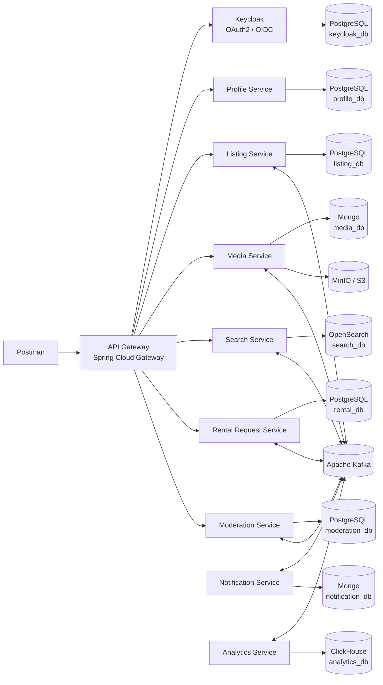
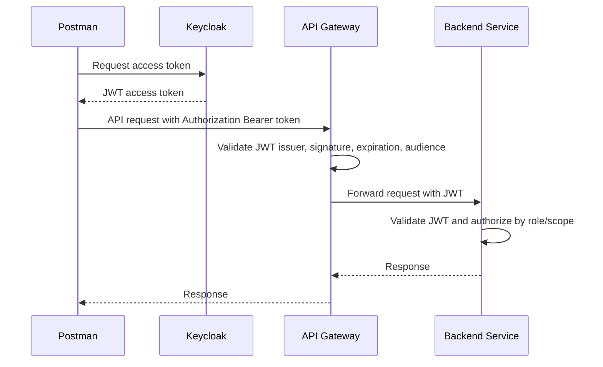
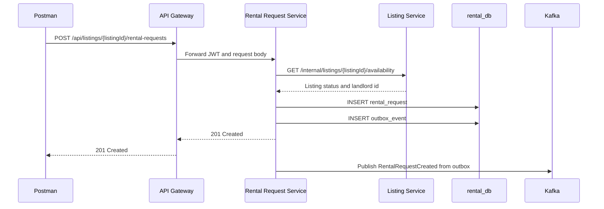
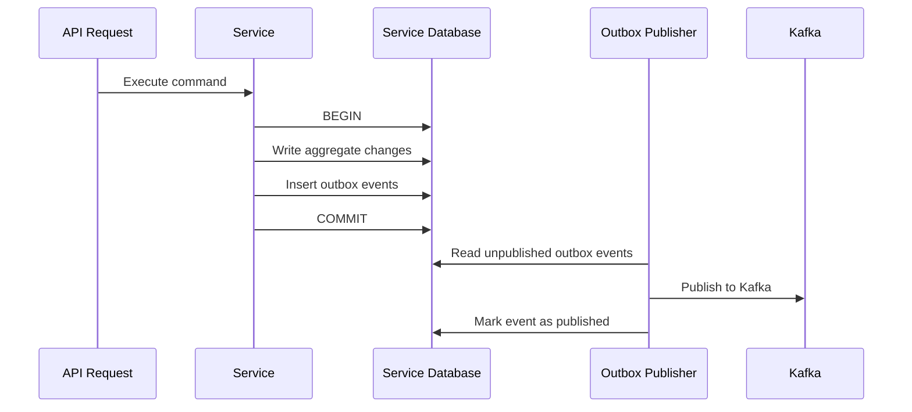
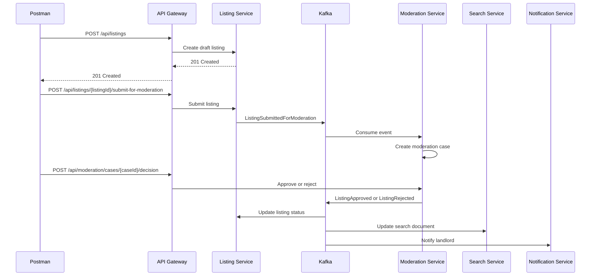
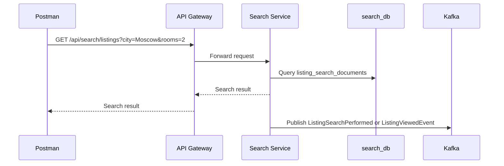
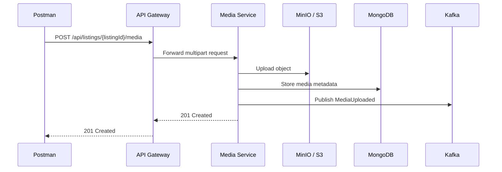
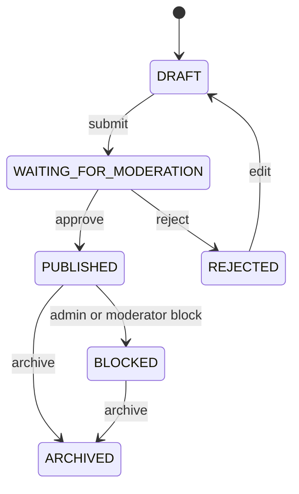

# Distributed system of the Estate Booking Platform

[](https://github.com/thisdudkin/estate-booking-platform/actions/workflows/maven.yml)

## Overview

Estate Booking Platform is an educational-distributed system inspired by real estate marketplaces such
as [cian.ru](https://cian.ru). The project is designed to strengthen practical backend
engineering skills in microservice architecture, security, relational and non-relational data modeling, synchronous and
asynchronous communication, and Kafka delivery semantics.

The platform intentionally omits a frontend application. All public API calls are expected to be executed through tools
such as Postman, curl, HTTPie, or automated integration tests.

The system models a real estate rental marketplace where landlords publish listings, moderators review listing quality
and complaints, and tenants search for properties and create rental requests.

## Goals

The main goal of the project is not to build a production marketplace, but to provide a realistic training ground for
distributed system design and implementation.

The project covers:

- Microservice decomposition by business capability.
- OAuth2 and OpenID Connect based security with Keycloak and RBAC.
- Synchronous service-to-service communication over HTTP.
- Asynchronous communication through Apache Kafka.
- At most once, at least once, and exactly once or effectively exactly once message delivery semantics.
- SQL and NoSQL persistence models
- JPA Free: JOOQ-based relational data access instead of JPA.
- Spring MVC with Virtual Threads.
- Spring WebFlux for reactive I/O-heavy services.
- Transactional outbox pattern.
- Idempotent Kafka consumers.
- Denormalized search read models.

## Functional Scope

The application supports the following high-level capabilities:

- User profile management.
- Real estate listing creation and management.
- Listing media upload and processing.
- Listing moderation.
- Tenant search.
- Saved searches.
- Rental requests.
- Request messages.
- Viewing scheduling.
- User notifications.
- Basic analytics.

## Out of Scope

The following concerns are intentionally outside the core scope:

- Frontend implementation.
- Online payments.
- Legal document signing.
- Real geocoding integration.
- Real email or SMS provider integration.
- Complex recommendation algorithms.
- Production-grade fraud detection.

## User Roles

The platform has four business roles. Roles are managed in Keycloak and propagated to backend services through JWT
access tokens.

| Role             | Description                                                                                   |
|------------------|-----------------------------------------------------------------------------------------------|
| `ROLE_ADMIN`     | Has administrative access to users, system settings, dictionaries, and moderation operations. |
| `ROLE_MODERATOR` | Reviews listings, handles complaints, approves or rejects listings.                           |
| `ROLE_LANDLORD`  | Creates listings, uploads media, submits listings for moderation, manages rental requests.    |
| `ROLE_TENANT`    | Searches listings, saves listings, creates rental requests, communicates with landlords.      |

## Architecture Principles

The system follows several important architectural principles.

### Database per Service

Each microservice owns its database schema or collection set. Services must not directly read or write another service's
database.

### Bounded Context Ownership

Each service owns a clearly defined part of the domain model. For example, the Listing Service owns listing state, while
the Search Service owns only a denormalized read model.

### API Gateway

All external requests go through the API Gateway. Backend services are not exposed directly to external clients.

### Identity Provider Separation

Authentication and identity management are delegated to Keycloak. Business services consume validated JWT tokens and
enforce authorization rules locally.

### Event-Driven Read Models

Read models such as search documents and analytics projections are updated asynchronously through Kafka events.

### No JPA

Relational services use JOOQ for SQL access. JPA and Hibernate are intentionally excluded from this project.

## High-Level Architecture



## Microservices

| Service                | Technology                    | Storage       | Responsibility                                                  |
|------------------------|-------------------------------|---------------|-----------------------------------------------------------------|
| API Gateway            | Spring Cloud Gateway, WebFlux | None          | External entry point, request routing, JWT validation.          |
| Keycloak               | Keycloak                      | PostgreSQL    | OAuth2 / OIDC Identity Provider, user, clients, roles.          |
| Profile Service        | Spring MVC + Virtual Threads  | PostgreSQL    | User profiles, landlords and tenant profile data, favorites.    |
| Listing Service        | Spring MVC + Virtual Threads  | PostgreSQL    | Listings, listing details, locations, lifecycle status.         |
| Media Service          | Spring WebFlux                | Mongo + MinIO | Media metadata, file upload, processing jobs.                   |
| Moderation Service     | Spring MVC + Virtual Threads  | PostgreSQL    | Moderation cases, desicions, complaints, rules.                 |
| Search Service         | Spring WebFlux                | OpenSearch    | Search read model, saved searches, recent searches.             |
| Rental Request Service | Spring MVC + Virtual Threads  | PostgreSQL    | Rental requests, request messages, viewings, rental agreements. |
| Notification Service   | Spring WebFlux                | Mongo         | Notification templates, messages, user preferences.             |
| Analytics Service      | Spring WebFlux                | ClickHouse    | Listing views, daily statistics, event-based analytics.         |

## Security Architecture

Keycloak acts as the Identity Provider. Backend services act as OAuth2 Resource Servers.



### Authorization Rules

| Endpoint                                               | Allowed Roles                              |
|--------------------------------------------------------|--------------------------------------------|
| `GET /api/profile/me`                                  | `ADMIN`, `MODERATOR`, `LANDLORD`, `TENANT` |
| `PUT /api/profile/me`                                  | `ADMIN`, `MODERATOR`, `LANDLORD`, `TENANT` |
| `POST /api/listings`                                   | `LANDLORD`                                 |
| `PATCH /api/listings/{listingId}`                      | Listing owner or `ADMIN`                   |
| `POST /api/listings/{listingId}/submit-for-moderation` | Listing owner with `LANDLORD` role         |
| `POST /api/listings/{listingId}/archive`               | Listing owner or `ADMIN`                   |
| `GET /api/search/listings`                             | Authenticated users                        |
| `POST /api/listings/{listingId}/rental-requests`       | `TENANT`                                   |
| `GET /api/moderation/cases`                            | `MODERATOR`, `ADMIN`                       |
| `POST /api/moderation/cases/{caseId}/decision`         | `MODERATOR`, `ADMIN`                       |
| `POST /api/moderation/complaints`                      | `TENANT`                                   |

### Rental Request Creation Flow



## Asynchronous Communication

Asynchronous communication is implemented through Apache Kafka.

Kafka is used for:

- Publishing domain events.
- Updating denormalized read models.
- Sending notification commands.
- Feeding analytics projections.
- Decoupling moderation and listing lifecycle changes.

## Kafka Topics

| Topic                        | Producer                            | Consumer                                                 | Delivery Semantics |
|------------------------------|-------------------------------------|----------------------------------------------------------|--------------------|
| `profile.events`             | Profile Service                     | Notification Service, Analytics Service                  | At least once      |
| `listing.events`             | Listing Service                     | Moderation Service, Search Service, Notification Service | At least once      |
| `listing.publication.events` | Listing Service, Moderation Service | Search Service                                           | Exactly once       |
| `moderation.events`          | Moderation Service                  | Listing Service, Notification Service                    | At least once      |
| `rental-request.events`      | Rental Request Service              | Notification Service, Analytics Service                  | At least once      |
| `media.events`               | Media Service                       | Listing Service, Moderation Service, Search Service      | At least once      |
| `listing-view.events`        | API Gateway, Search Service         | Analytics Service                                        | At most once       |
| `notification.commands`      | Multiple services                   | Notification Service                                     | At least once      |

## Kafka Partitioning Strategy

| Event Type                 | Kafka Key                 |
|----------------------------|---------------------------|
| Listing events             | `listingId`               |
| Listing publication events | `listingId`               |
| Moderation events          | `listingId` or `caseId`   |
| Rental request events      | `rentalRequestId`         |
| Media events               | `listingId`               |
| Listing view events        | `listingId` or `tenantId` |
| Notification commands      | `recipientUserId`         |

## Transactional Outbox Pattern

SQL-based services should not publish Kafka messages directly inside business logic after commiting a database
transaction. Instead, they should write domain changes and an outbox event in the same database transaction.



This pattern prevents the classic dual-write problem between a database and Kafka.

## Idempotent Consumer Pattern

Consumers that perform side effect must be idempotent.

Recommended options:

- Store processed event IDs.
- Use natural idempotency keys.
- Use unique constraints.
- Use upserts instead of blind inserts.
- Compare aggregate versions.
- Make external calls idempotent through client-provided IDs where possible.

## Core Business Flows

### Listing Publication Flow



### Search Flow



### Media Upload Flow



## Public API Surface

### Profile Service

```http
GET    /api/profile/me
PUT    /api/profile/me
GET    /api/profile/users/{userId}
PATCH  /api/profile/users/{userId}/status
POST   /api/profile/favorites/{listingId}
DELETE /api/profile/favorites/{listingId}
GET    /api/profile/favorites
```

### Listing Service

```http
POST   /api/listings
GET    /api/listings/{listingId}
PATCH  /api/listings/{listingId}
POST   /api/listings/{listingId}/submit-for-moderation
POST   /api/listings/{listingId}/archive
```

### Media Service

```http
POST   /api/listings/{listingId}/media
GET    /api/listings/{listingId}/media
DELETE /api/listings/{listingId}/media/{mediaId}
```

### Search Service

```http
GET    /api/search/listings
POST   /api/search/saved-searches
GET    /api/search/saved-searches
DELETE /api/search/saved-searches/{savedSearchId}
```

### Moderation Service

```http
GET    /api/moderation/cases
GET    /api/moderation/cases/{caseId}
POST   /api/moderation/cases/{caseId}/decision
POST   /api/moderation/complaints
GET    /api/moderation/complaints
POST   /api/moderation/complaints/{complaintId}/resolve
```

### Rental Request Service

```http
POST   /api/listings/{listingId}/rental-requests
GET    /api/rental-requests
GET    /api/rental-requests/{requestId}
POST   /api/rental-requests/{requestId}/messages
POST   /api/rental-requests/{requestId}/accept
POST   /api/rental-requests/{requestId}/reject
POST   /api/rental-requests/{requestId}/viewings
```

### Notification Service

```http
GET    /api/notifications
POST   /api/notifications/{notificationId}/read
GET    /api/notification-preferences
PUT    /api/notification-preferences
```

## Data Model

The project intentionally keeps schemas simple. Each microservice has no more than five tables or collections, except
Keycloak, because Keycloak manages its own schema.

## Profile Service Data Model

### `user_profiles`

```sql
CREATE TABLE user_profiles
(
    id               uuid PRIMARY KEY,
    keycloak_user_id uuid         NOT NULL UNIQUE,
    email            varchar(255) NOT NULL UNIQUE,
    phone            varchar(32),
    display_name     varchar(255),
    status           varchar(32)  NOT NULL,
    created_at       timestamp    NOT NULL,
    updated_at       timestamp    NOT NULL
)
```

### `landlord_profiles`

```sql
CREATE TABLE landlord_profiles
(
    user_id             uuid PRIMARY KEY REFERENCES user_profiles,
    company_name        varchar(255),
    verification_status varchar(32) NOT NULL,
    tax_number          varchar(64),
    created_at          timestamp   NOT NULL,
    updated_at          timestamp   NOT NULL
)
```

### `tenant_profiles`

```sql
CREATE TABLE tenant_profiles
(
    user_id             uuid PRIMARY KEY REFERENCES user_profiles,
    preferred_city      varchar(128),
    preferred_min_price numeric(12, 2),
    preferred_max_price numeric(12, 2),
    preferences         jsonb,
    created_at          timestamp NOT NULL,
    updated_at          timestamp NOT NULL
)
```

### `favorite_listings`

```sql
CREATE TABLE favorite_listings
(
    tenant_id  uuid      NOT NULL REFERENCES user_profiles,
    listing_id uuid      NOT NULL,
    created_at timestamp NOT NULL,
    PRIMARY KEY (tenant_id, listing_id)
)
```

### `outbox_events`

```sql
CREATE TABLE outbox_events
(
    id             uuid PRIMARY KEY,
    aggregate_type varchar(64)  NOT NULL,
    aggregate_id   uuid         NOT NULL,
    event_type     varchar(128) NOT NULL,
    payload        jsonb        NOT NULL,
    status         varchar(32)  NOT NULL,
    created_at     timestamp    NOT NULL,
    published_at   timestamp
)
```

## Listing Service Data Model

### `listings`

```sql
CREATE TABLE listings
(
    id                uuid PRIMARY KEY,
    landlord_id       uuid           NOT NULL,
    title             varchar(255)   NOT NULL,
    description       text,
    property_type     varchar(64)    NOT NULL,
    deal_type         varchar(64)    NOT NULL,
    price             numeric(12, 2) NOT NULL,
    currency          varchar(8)     NOT NULL,
    status            varchar(64)    NOT NULL,
    moderation_status varchar(64)    NOT NULL,
    version           bigint         NOT NULL,
    created_at        timestamp      NOT NULL,
    updated_at        timestamp      NOT NULL
)
```

### `listing_locations`

```sql
CREATE TABLE listing_locations
(
    listing_id uuid PRIMARY KEY REFERENCES listings,
    country    varchar(128) NOT NULL,
    city       varchar(128) NOT NULL,
    district   varchar(128),
    street     varchar(255),
    house      varchar(64),
    latitude   numeric(10, 7),
    longitude  numeric(10, 7)
)
```

### `listing_details`

```sql
CREATE TABLE listing_details
(
    listing_id   uuid PRIMARY KEY REFERENCES listings,
    rooms        integer,
    total_area   numeric(8, 2),
    living_area  numeric(8, 2),
    kitchen_area numeric(8, 2),
    floor        integer,
    floors_total integer,
    amenities    jsonb
)
```

### `listing_status_history`

```sql
CREATE TABLE listing_status_history
(
    id              uuid PRIMARY KEY,
    listing_id      uuid        NOT NULL REFERENCES listings,
    previous_status varchar(64),
    new_status      varchar(64) NOT NULL,
    reason          text,
    changed_by      uuid,
    changed_at      timestamp   NOT NULL
)
```

### `outbox_events`

```sql
CREATE TABLE outbox_events
(
    id             uuid PRIMARY KEY,
    aggregate_type varchar(64)  NOT NULL,
    aggregate_id   uuid         NOT NULL,
    event_type     varchar(128) NOT NULL,
    payload        jsonb        NOT NULL,
    status         varchar(32)  NOT NULL,
    created_at     timestamp    NOT NULL,
    published_at   timestamp
)
```

## Media Service Data Model

Physical files are stored in MinIO or S3-compatible object storage. Mongo stored metadata only.

### `media_assets`

```json
{
  "_id": "uuid",
  "listingId": "uuid",
  "ownerId": "uuid",
  "storageBucket": "listing-media",
  "storageKey": "listings/{listingId}/{mediaId}.jpg",
  "contentType": "image/jpeg",
  "sizeBytes": 123456,
  "checksum": "sha256",
  "status": "UPLOADED | PROCESSED | REJECTED | DELETED",
  "sortOrder": 1,
  "createdAt": "timestamp",
  "updatedAt": "timestamp"
}
```

### `media_processing_jobs`

```json
{
  "_id": "uuid",
  "mediaId": "uuid",
  "listingId": "uuid",
  "jobType": "IMAGE_RESIZE | VIRUS_SCAN | CONTENT_CHECK",
  "status": "NEW | PROCESSING | DONE | FAILED",
  "errorMessage": null,
  "createdAt": "timestamp",
  "updatedAt": "timestamp"
}
```

### `processed_events`

```json
{
  "_id": "eventId",
  "eventType": "MediaUploaded",
  "processedAt": "timestamp"
}
```

## Moderation Service Data Model

### `moderation_cases`

```sql
CREATE TABLE moderation_cases
(
    id                    uuid PRIMARY KEY,
    listing_id            uuid        NOT NULL,
    landlord_id           uuid        NOT NULL,
    status                varchar(64) NOT NULL,
    priority              varchar(32) NOT NULL,
    assigned_moderator_id uuid,
    created_at            timestamp   NOT NULL,
    updated_at            timestamp   NOT NULL
)
```

### `moderation_decisions`

```sql
CREATE TABLE moderation_decisions
(
    id           uuid PRIMARY KEY,
    case_id      uuid        NOT NULL REFERENCES moderation_cases,
    moderator_id uuid        NOT NULL,
    decision     varchar(64) NOT NULL,
    reason       text,
    created_at   timestamp   NOT NULL
)
```

### `complaints`

```sql
CREATE TABLE complaints
(
    id          uuid PRIMARY KEY,
    listing_id  uuid         NOT NULL,
    tenant_id   uuid         NOT NULL,
    reason      varchar(128) NOT NULL,
    description text,
    status      varchar(64)  NOT NULL,
    created_at  timestamp    NOT NULL,
    updated_at  timestamp    NOT NULL
)
```

### `moderation_rules`

```sql
CREATE TABLE moderation_rules
(
    id          uuid PRIMARY KEY,
    code        varchar(128) NOT NULL UNIQUE,
    description text         NOT NULL,
    enabled     boolean      NOT NULL,
    severity    varchar(32)  NOT NULL
)
```

### `outbox_events`

```sql
CREATE TABLE outbox_events
(
    id             uuid PRIMARY KEY,
    aggregate_type varchar(64)  NOT NULL,
    aggregate_id   uuid         NOT NULL,
    event_type     varchar(128) NOT NULL,
    payload        jsonb        NOT NULL,
    status         varchar(32)  NOT NULL,
    created_at     timestamp    NOT NULL,
    published_at   timestamp
)
```

## Search Service Data Model

The search model is denormalized and should not be treated as the source of truth.

### `listing_search_documents`

```json
{
  "_id": "listingId",
  "listingVersion": 7,
  "title": "2-room apartment near metro",
  "description": "Short description",
  "city": "Moscow",
  "district": "Patriki",
  "location": {
    "lat": 55.7558,
    "lon": 37.6173
  },
  "propertyType": "APARTMENT",
  "dealType": "RENT",
  "price": 120000.00,
  "currency": "RUB",
  "rooms": 2,
  "totalArea": 55.4,
  "floor": 5,
  "media": [
    {
      "mediaId": "uuid",
      "url": "https://cdn.local/listings/..."
    }
  ],
  "status": "PUBLISHED",
  "publishedAt": "timestamp",
  "updatedAt": "timestamp"
}
```

### `saved_searches`

```json
{
  "_id": "uuid",
  "tenantId": "uuid",
  "name": "Moscow 2 rooms",
  "filters": {
    "city": "Moscow",
    "rooms": 2,
    "minPrice": 80000,
    "maxPrice": 150000
  },
  "createdAt": "timestamp"
}
```

### `recent_searches`

```json
{
  "_id": "uuid",
  "tenantId": "uuid",
  "filters": {
    "city": "Moscow",
    "rooms": 2
  },
  "createdAt": "timestamp"
}
```

### `search_projection_offsets`

```json
{
  "_id": "topic-partition",
  "topic": "listing.publication.events",
  "partition": 0,
  "offset": 123456,
  "updatedAt": "timestamp"
}
```

## Rental Request Service Data Model

### `rental_requests`

```sql
CREATE TABLE rental_requests
(
    id              uuid PRIMARY KEY,
    listing_id      uuid        NOT NULL,
    tenant_id       uuid        NOT NULL,
    landlord_id     uuid        NOT NULL,
    status          varchar(64) NOT NULL,
    initial_message text,
    created_at      timestamp   NOT NULL,
    updated_at      timestamp   NOT NULL,
    version         bigint      NOT NULL
)
```

### `request_messages`

```sql
CREATE TABLE request_messages
(
    id         uuid PRIMARY KEY,
    request_id uuid      NOT NULL REFERENCES rental_requests,
    sender_id  uuid      NOT NULL,
    message    text      NOT NULL,
    created_at timestamp NOT NULL
)
```

### `viewings`

```sql
CREATE TABLE viewings
(
    id         uuid PRIMARY KEY,
    request_id uuid        NOT NULL REFERENCES rental_requests,
    starts_at  timestamp   NOT NULL,
    ends_at    timestamp   NOT NULL,
    status     varchar(64) NOT NULL,
    created_at timestamp   NOT NULL,
    updated_at timestamp   NOT NULL
)
```

### `rental_agreements`

```sql
CREATE TABLE rental_agreements
(
    id            uuid PRIMARY KEY,
    request_id    uuid           NOT NULL REFERENCES rental_requests,
    status        varchar(64)    NOT NULL,
    start_date    date           NOT NULL,
    end_date      date,
    monthly_price numeric(12, 2) NOT NULL,
    created_at    timestamp      NOT NULL,
    updated_at    timestamp      NOT NULL
)
```

### `outbox_events`

```sql
CREATE TABLE outbox_events
(
    id             uuid PRIMARY KEY,
    aggregate_type varchar(64)  NOT NULL,
    aggregate_id   uuid         NOT NULL,
    event_type     varchar(128) NOT NULL,
    payload        jsonb        NOT NULL,
    status         varchar(32)  NOT NULL,
    created_at     timestamp    NOT NULL,
    published_at   timestamp
)
```

## Notification Service Data Model

### `notification_templates`

```json
{
  "_id": "RentalRequestCreated",
  "channel": "EMAIL",
  "subjectTemplate": "New rental request",
  "bodyTemplate": "Tenant {{tenantName}} sent request for listing {{listingTitle}}",
  "enabled": true
}
```

### `notification_messages`

```json
{
  "_id": "uuid",
  "recipientUserId": "uuid",
  "channel": "EMAIL | TELEGRAM | IN_APP",
  "templateCode": "RentalRequestCreated",
  "payload": {
    "listingId": "uuid",
    "requestId": "uuid"
  },
  "status": "NEW | SENT | FAILED",
  "createdAt": "timestamp",
  "sentAt": "timestamp"
}
```

### `notification_preferences`

```json
{
  "_id": "userId",
  "emailEnabled": true,
  "telegramEnabled": false,
  "inAppEnabled": true,
  "updatedAt": "timestamp"
}
```

### `processed_events`

```json
{
  "_id": "eventId",
  "eventType": "RentalRequestCreated",
  "processedAt": "timestamp"
}
```

## Analytics Service Data Model

### `listing_view_events`

```json
{
  "_id": "uuid",
  "listingId": "uuid",
  "tenantId": "uuid",
  "city": "Moscow",
  "viewedAt": "timestamp",
  "source": "SEARCH | DIRECT"
}
```

### `daily_listing_stats`

```json
{
  "_id": "listingId:2026-06-13",
  "listingId": "uuid",
  "date": "2026-06-13",
  "views": 250,
  "uniqueTenantViews": 120,
  "rentalRequests": 8
}
```

## Domain Events

### Common Event Envelope

All domain events should use a shared envelope.

```json
{
  "eventId": "uuid",
  "eventType": "ListingSubmittedForModeration",
  "aggregateType": "Listing",
  "aggregateId": "listingId",
  "aggregateVersion": 3,
  "occurredAt": "timestamp",
  "producer": "listing-service",
  "payload": {
    "listingId": "uuid",
    "landlordId": "uuid"
  }
}
```

### Listing Events

```text
ListingCreated
ListingUpdated
ListingSubmittedForModeration
ListingPublished
ListingArchived
ListingRejected
```

### Media Events

```text
MediaUploaded
MediaProcessed
MediaDeleted
```

### Moderation Events

```text
ModerationCaseCreated
ListingApproved
ListingRejected
ComplaintCreated
ComplaintResolved
```

### Rental Request Events

```text
RentalRequestCreated
RentalRequestAccepted
RentalRequestRejected
ViewingScheduled
RentalAgreementCreated
```

### Notification Events and Commands

```text
NotificationRequested
NotificationCreated
NotificationSent
NotificationFailed
```

### Analytics Events

```text
ListingViewed
ListingSearchPerformed
DailyListingStatsUpdated
```

## Listing Lifecycle

A listing can have the following statuses:

```text
DRAFT
WAITING_FOR_MODERATION
REJECTED
PUBLISHED
ARCHIVED
BLOCKED
```

Moderation status can be tracked separately:

```text
NOT_REQUIRED
PENDING
APPROVED
REJECTED
```

Recommended lifecycle:



## Recommended Package Structure

For each Spring service, use a clean modular structure.

```text
src/main/java/io/petproject/estate/booking/platform/<service>
├── presentation
│   ├── controller
│   ├── request
│   └── response
├── application
│   ├── command
│   ├── handler
│   └── service
├── domain
│   ├── model
│   ├── event
│   └── exception
├── infrastructure
│   ├── config
│   ├── persistence
│   ├── kafka
│   └── security
└── <ServiceApplication>.java
```

## Local Development Infrastructure

A local deployment should include:

```text
PostgreSQL for Keycloak
PostgreSQL for profile_db
PostgreSQL for listing_db
PostgreSQL for moderation_db
PostgreSQL for rental_db
Mongo
Apache Kafka Cluster
Kafka UI
Keycloak
MinIO
OpenSearch
API Gateway
Application Services
```

## Testing Strategy

Recommended test levels:

| Level             | Tooling                                   | Purpose                                                |
|-------------------|-------------------------------------------|--------------------------------------------------------|
| Unit tests        | JUnit 5, AssertJ, Mockito                 | Domain rules and application services.                 |
| Integration tests | Testcontainers                            | PostgreSQL, Mongo, Kafka, MinIO, Keycloak integration. |
| Contract tests    | Spring Cloud Contract or Pact             | Service API compatibility.                             |
| Security tests    | Spring Security Test                      | Role-based access checks.                              |
| Kafka tests       | Testcontainers Kafka / Mocks / Awaitility | Delivery semantics, idempotency, outbox behaviour.     |
| API tests         | Postman                                   | End-to-end HTTP flows.                                 |

## Observability

The educational version should still include basic observability patterns.

Recommended stack:

- Structured JSON logging.
- Correlation ID propagation.
- Spring Boot Actuator.
- Micrometer metrics.
- Prometheus.
- Grafana.
- OpenTelemetry tracing.
- Loki for logs.

Every service should propagate correlation IDs to logs, HTTP calls, and Kafka message headers.

## Reliability Patterns

Recommended patterns:

- Request timeouts.
- Retries only for safe and idempotent operations.
- Circuit breakers for synchronous dependencies.
- Bulkheads for slow downstream systems.
- Dead-letter topics for poison Kafka messages.
- Idempotency keys for command APIs where duplicate submissions are possible.
- Optimistic locking through aggregate versions.
- Transactional outbox for SQL-to-Kafka publishing.

## Error Handling

All HTTP APIs should return a consistent error format.

```json
{
  "timestamp": "2026-06-13T12:00:00Z",
  "status": 400,
  "error": "Bad Request",
  "code": "LISTING_VALIDATION_FAILED",
  "message": "Listing price must be greater than zero",
  "path": "/api/listings",
  "correlationId": "uuid"
}
```
